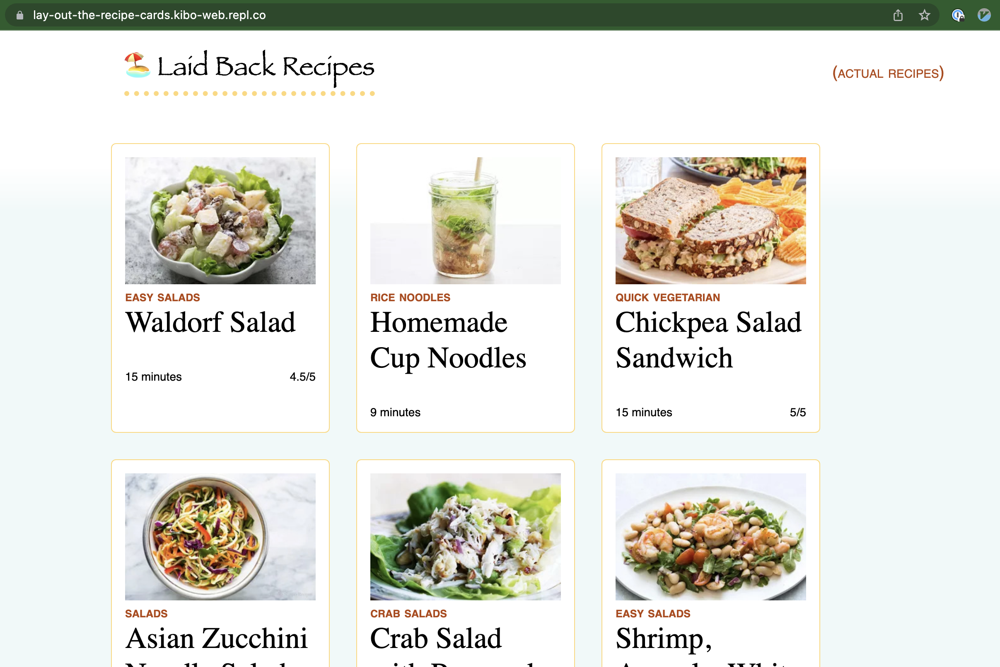

# Lay out the Recipe Cards

Lots of websites use "cards" to make browsing more appealing. This recipe site has styled the overview information about some of its recipes to look like cards.

But, the recipes aren't organized well on the page. Your job will be to use layout to make the recipe cards look great.

## Instructions

**A grid for the cards**

* Make the div with class container a flexbox by setting `display` to `flex`.
* Adjust the flex properties applied to the `card` and `container` classes so that the cards show nicely in a flexible grid. Set `flex-wrap` to `wrap` so that the cards go onto the next line.

When you open the page in a wider screen, the cards should show side-by-side. When the screen is smaller, it'll show fewer columns.

**A max-width for the page**

* On large screens, the content looks too thin. Set a `max-width` of `900px` on the body and the header so that everything fits nicer.
* Move everything to the center by setting `margin: auto` on the body and header.

**A fixed header**

* Use the `position` property to make the header stay at the top when scrolling.
* When you do, it might look weird at first! Give it a background color like `#fff` to fix this.
* Now, there's not enough space at the top, so the recipes aren't showing up right. Add margin-top of to the `.container` to give the header enough space.
* Set the `top` to `0` so that the header is not shifted down
* The `position` change means the header isn't automatically as wide as it should be. Add `width: 90%` to the header.

When your work is complete, the site should look like this:

### Attribution

Idea, recipe descriptions, and links from https://www.simplyrecipes.com/. Check out their version of cards - it's not all that different from this one!
